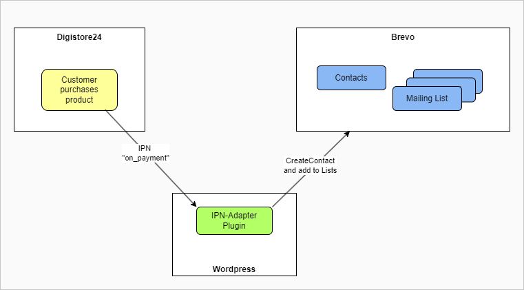

# WP Plugin to connect Digistore24 IPN to Brevo
This is a solution to connect Digistore24 with Brevo to add buyers to mailing-lists.

## Why?
Digistore24 currently does not support Brevo natively. So if you want to add buyers of your products to your mailing-lists, there is currently no easy (and free of extra charge) way to do this. So we had to find another solution. As there already was a website based on Wordpress involved, the easiest way was to write a small plugin for Wordpress, that acts as proxy between Digistore24 and Brevo.

## How does it work?
The IPN-Adapter plugin provides an endpoint that acts as proxy. When a purchase is done on Digistore24, it will call the IPN-Adapters endpoint. The endpoint will transform the data, received from Digistore24, to the data needed for Brevo. The IPN-Adapter will then add the buyers e-mail address as contact in Brevo and will add that e-mail address to the configured mailing lists.

This a graphical overview on how the IPN-adapter works:

If you install this plugin in your Wordpress, the endpoint that you need to configure in Digistore24, will be `https://<YOUR-SERVER>/wp-content/plugins/ipn-adapter/endpoint.php`.
To add this plugin to your Wordpress, download the zip-file from the latest release and upload it to your Wordpress.

## Setup of IPN-Adapter
Open the settings-page `IPN Adapter` in the Wordpress `Settings` menu and set the values accordingly.

| Field | Description |
|-----|-------------|
| Adapter endpoint for Digistore24 | The adapter endpoint URL, you need to set in Digistore24, is displayed. You can copy it the the clipboard by clicking on the clipboard-icon. Be sure to configure `POST` as method in Digistore24. |
| Digistore24 Secret               | The password you choose and set in Digistore24 for the IPN. |
| API Key                          | The API key from Brevo |
| Newsletter List ID               | Brevo list ID of your newsletter list. |
| Firstname field                  | The IPN-adapter will send the firstname of the buyer in an attribute with the given name |
| Lastname field                   | The IPN-adapter will send the lastname of the buyer in an attribute with the given name |
| Product ID Mapping               | Map Digistore24 product IDs to specific Brevo list IDs as needed |

## View Logs
The plugin writes logs to a file in the uploads-folder. Via the menu entry `IPN Logs` in the `Tools` menu, you can view those logs.

## Digistore24 hints
- Add a generic IPN.
- Be sure to deactivate grouping of calls.
- This plugin has not been tested with any AddOn products.
- Currently the endpoint only processes "on_payment" events. All other IPN events will be ignored for now.
- The plugin-endpoint will return `OK` to Digistore in case of success.

## Brevo hints
- Be aware that you need to add the IP-address of your Wordpress-server to the allowed addresses for API calls.
- Maybe you want to send other or more attributes to Brevo. You can change/add your attributes in the `$attributes` array in `ipn-adapter.php`.

## Bookmarks
- Brevo API docu for "createcontact": https://developers.brevo.com/reference/createcontact
- Digistore24 event docu: https://dev.digistore24.com/hc/en-us/articles/32480561422353-Events
